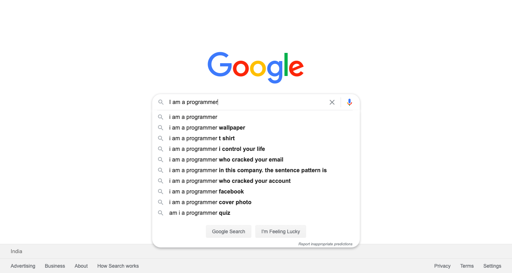

# html-css
HTML + CSS assignment repository for collab

## Assignment 1

Create a sample clone of the below page using HTML and CSS.

## Assignment 2

Design a Table with 4 rows and 3 columns. Fill it with dummy data. Make it as much presentable as you can.
